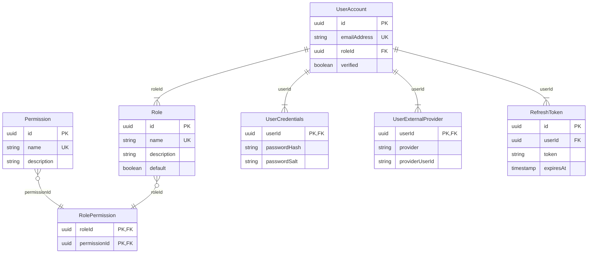

```mermaid
erDiagram
  Permission {
    uuid id PK
    string name UK
    string description
  }
  Permission many(0)--|| RolePermission : permissionId

  Role {
    uuid id PK
    string name UK
    string description
    boolean default
  }
  Role many(0)--|| RolePermission : roleId

  RolePermission {
    uuid roleId PK,FK
    uuid permissionId PK,FK
  }

  UserAccount {
    uuid id PK
    string emailAddress UK
    uuid roleId FK
    boolean verified
  }
  UserAccount ||--many(1) UserCredentials : userId
  UserAccount ||--many(1) UserExternalProvider : userId
  UserAccount ||--many(1) RefreshToken : userId
  UserAccount ||--many(1) Role : roleId

  UserCredentials {
    uuid userId PK,FK
    string passwordHash
    string passwordSalt
  }

  UserExternalProvider {
    uuid userId PK,FK
    string provider
    string providerUserId
  }

  RefreshToken {
    uuid id PK
    uuid userId FK
    string token
    timestamp expiresAt
  }
```