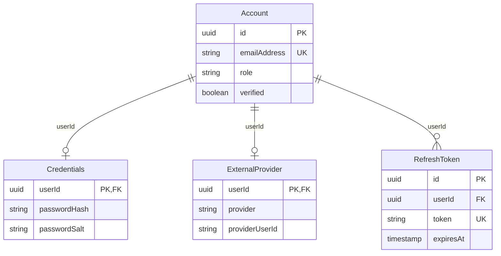

# Auth Schema

## Tables and Columns

### auth.Account

A user account.

| Column | Type | Description |
|--------|------|-------------|
| id | UUID | The id of the user |
| emailAddress | VARCHAR(255) | The email address of the user |
| role | VARCHAR(255) | The name of the role of the user |
| verified | BOOLEAN | Whether the user is verified |

### auth.Credentials

A user credentials.

| Column | Type | Description |
|--------|------|-------------|
| userId | UUID | Foreign key to the user |
| passwordHash | VARCHAR(255) | The password hash of the user |
| passwordSalt | VARCHAR(255) | The password salt of the user |

### auth.ExternalProvider

A user external provider.

| Column | Type | Description |
|--------|------|-------------|
| userId | UUID | Foreign key to the user |
| provider | VARCHAR(255) | The provider of the user |
| providerUserId | VARCHAR(255) | The id of the user in the external provider |

### auth.RefreshToken

A refresh token.

| Column | Type | Description |
|--------|------|-------------|
| id | UUID | The ID of the refresh token |
| userId | UUID | Foreign key to the user |
| token | VARCHAR(255) | The token |
| expiresAt | TIMESTAMP | The expiration date |
