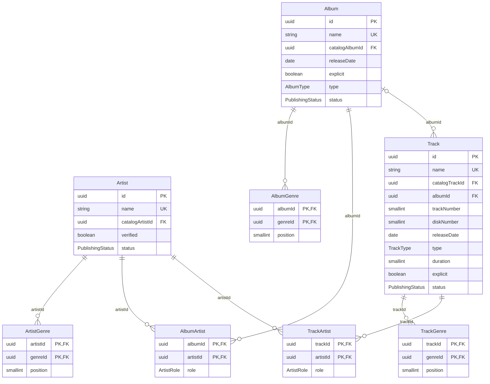

# Backstage Schema

Note: `ArtistGenre`, `AlbumGenre`, and `TrackGenre` reference `catalog.Genre`. `Artist`, `Album`, and `Track` reference `catalog.Artist`, `catalog.Album`, and `catalog.Track` respectively when published.

## Enums

- **PublishingStatus**: `DRAFT`, `PROCESSING`, `PUBLISHED`, `REJECTED`

Referenced from catalog schema: **AlbumType**, **TrackType**, **ArtistRole**

## Tables and Columns

### backstage.Artist

An artist.

| Column | Type | Description |
|--------|------|-------------|
| id | UUID | The ID of the artist |
| name | VARCHAR(255) | The name of the artist |
| catalogArtistId | UUID | Foreign key to the catalog artist |
| verified | BOOLEAN | Whether the artist is verified |
| status | PublishingStatus | The status of the publishing process |

### backstage.ArtistGenre

A relationship between an artist and a genre.

| Column | Type | Description |
|--------|------|-------------|
| artistId | UUID | Foreign key to the artist |
| genreId | UUID | Foreign key to the genre |
| position | SMALLINT | The position of the genre in the artist's genres |

### backstage.Album

An album.

| Column | Type | Description |
|--------|------|-------------|
| id | UUID | The ID of the album |
| name | VARCHAR(255) | The name of the album |
| catalogAlbumId | UUID | Foreign key to the catalog album |
| releaseDate | DATE | The release date of the album |
| explicit | BOOLEAN | Whether the album is explicit |
| type | AlbumType | The type of the album |
| status | PublishingStatus | The status of the publishing process |

### backstage.AlbumGenre

A relationship between an album and a genre.

| Column | Type | Description |
|--------|------|-------------|
| albumId | UUID | Foreign key to the album |
| genreId | UUID | Foreign key to the genre |
| position | SMALLINT | The position of the genre in the album's genres |

### backstage.AlbumArtist

A relationship between an album and an artist.

| Column | Type | Description |
|--------|------|-------------|
| albumId | UUID | Foreign key to the album |
| artistId | UUID | Foreign key to the artist |
| role | ArtistRole | The role of the artist in the album |

### backstage.Track

A track.

| Column | Type | Description |
|--------|------|-------------|
| id | UUID | The ID of the track |
| name | VARCHAR(255) | The name of the track |
| catalogTrackId | UUID | Foreign key to the catalog track |
| albumId | UUID | Foreign key to the album |
| trackNumber | SMALLINT | The track number of the track |
| diskNumber | SMALLINT | The disk number of the track |
| releaseDate | DATE | The release date of the track |
| type | TrackType | The type of the track |
| duration | SMALLINT | The duration of the track |
| explicit | BOOLEAN | Whether the track is explicit |
| status | PublishingStatus | The status of the publishing process |

### backstage.TrackGenre

A relationship between a track and a genre.

| Column | Type | Description |
|--------|------|-------------|
| trackId | UUID | Foreign key to the track |
| genreId | UUID | Foreign key to the genre |
| position | SMALLINT | The position of the genre in the track's genres |

### backstage.TrackArtist

A relationship between a track and an artist.

| Column | Type | Description |
|--------|------|-------------|
| trackId | UUID | Foreign key to the track |
| artistId | UUID | Foreign key to the artist |
| role | ArtistRole | The role of the artist in the track |
