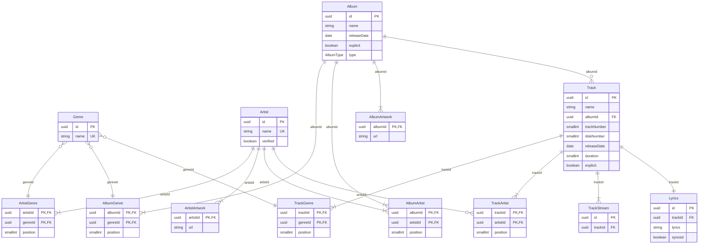

```mermaid
erDiagram
  Genre {
    uuid id PK
    string name UK
  }
  Genre many(0)--|| ArtistGenre : genreId
  Genre many(0)--|| AlbumGenre : genreId
  Genre many(0)--|| TrackGenre : genreId

  Artist {
    uuid id PK
    string name UK
    boolean verified
  }
  Artist ||--many(1) ArtistGenre : artistId
  Artist ||--many(1) ArtistArtwork : artistId
  Artist ||--many(1) AlbumArtist : artistId
  Artist ||--many(0) TrackArtist : artistId

  ArtistGenre {
    uuid artistId PK,FK
    uuid genreId PK,FK
    smallint position
  }

  ArtistArtwork {
    uuid artistId PK,FK
    string url
  }

  Album {
    uuid id PK
    string name
    date releaseDate
    boolean explicit
    AlbumType type
  }
  Album ||--many(1) AlbumGenre : albumId
  Album ||--many(1) AlbumArtist : albumId
  Album ||--many(1) AlbumArtwork : albumId
  Album ||--many(0) Track : albumId

  AlbumGenre {
    uuid albumId PK,FK
    uuid genreId PK,FK
    smallint position
  }

  AlbumArtist {
    uuid albumId PK,FK
    uuid artistId PK,FK
    smallint position
  }

  AlbumArtwork {
    uuid albumId PK,FK
    string url
  }

  Track {
    uuid id PK
    string name
    uuid albumId FK
    smallint trackNumber
    smallint diskNumber
    date releaseDate
    smallint duration
    boolean explicit
  }
  Track ||--many(1) TrackGenre : trackId
  Track ||--many(1) TrackArtist : trackId
  Track ||--many(1) TrackStream : trackId
  Track ||--1 Lyrics : trackId

  TrackGenre {
    uuid trackId PK,FK
    uuid genreId PK,FK
    smallint position
  }

  TrackArtist {
    uuid trackId PK,FK
    uuid artistId PK,FK
    smallint position
  }

  TrackStream {
    uuid id PK
    uuid trackId FK
  }

  Lyrics {
    uuid id PK
    uuid trackId FK
    string lyrics
    boolean synced
  }
```