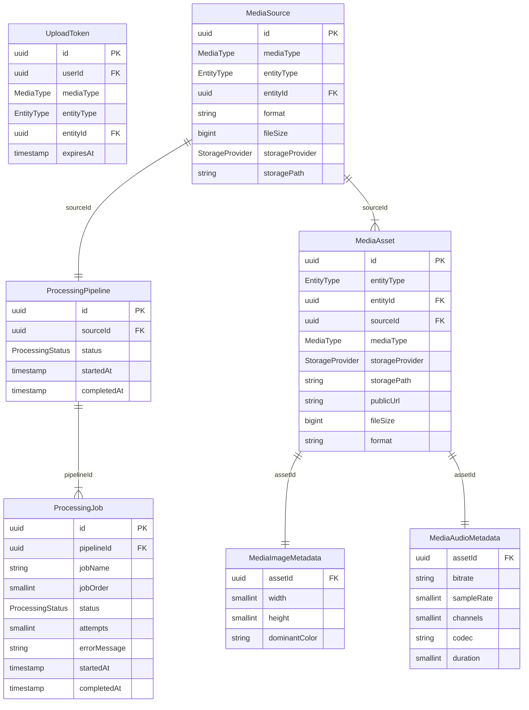

```mermaid
erDiagram
  UploadToken {
    uuid id PK
    uuid userId FK
    MediaType mediaType
    EntityType entityType
    uuid entityId FK
    timestamp expiresAt
  }

  MediaSource {
    uuid id PK
    MediaType mediaType
    EntityType entityType
    uuid entityId FK
    string format
    bigint fileSize
    StorageProvider storageProvider
    string storagePath
  }
  MediaSource ||--1 ProcessingPipeline : sourceId
  MediaSource ||--many(1) MediaAsset : sourceId

  MediaAsset {
    uuid id PK
    EntityType entityType
    uuid entityId FK
    uuid sourceId FK
    MediaType mediaType
    StorageProvider storageProvider
    string storagePath
    string publicUrl
    bigint fileSize
    string format
  }
  MediaAsset ||--1 MediaImageMetadata : assetId
  MediaAsset ||--1 MediaAudioMetadata : assetId

  MediaImageMetadata {
    uuid assetId FK
    smallint width
    smallint height
    string dominantColor
  }

  MediaAudioMetadata {
    uuid assetId FK
    string bitrate
    smallint sampleRate
    smallint channels
    string codec
    smallint duration
  }

  ProcessingPipeline {
    uuid id PK
    uuid sourceId FK
    ProcessingStatus status
    timestamp startedAt
    timestamp completedAt
  }
  ProcessingPipeline ||--many(1) ProcessingJob : pipelineId

  ProcessingJob {
    uuid id PK
    uuid pipelineId FK
    string jobName
    smallint jobOrder
    ProcessingStatus status
    smallint attempts
    string errorMessage
    timestamp startedAt
    timestamp completedAt
  }
```