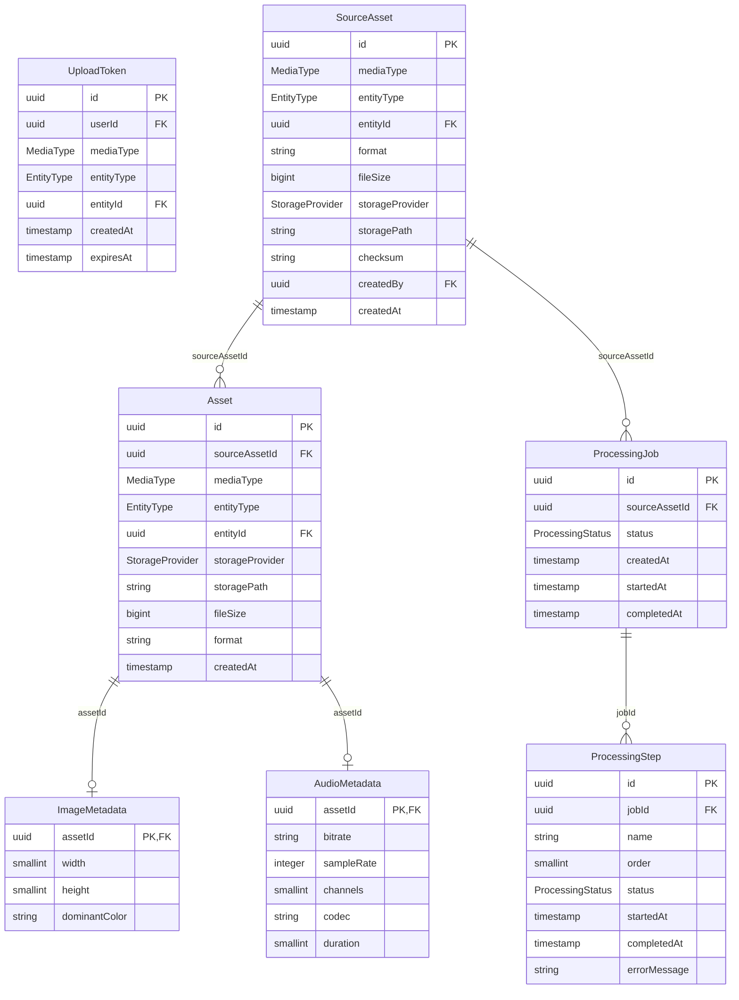

# Media Schema

## Enums

- **MediaType**: `IMAGE`, `AUDIO`
- **EntityType**: `ARTIST`, `ALBUM`, `TRACK`, `PLAYLIST`
- **StorageProvider**: `S3`, `LOCAL`, `CLOUDINARY`, `AZURE`
- **ProcessingStatus**: `PENDING`, `PROCESSING`, `COMPLETED`, `FAILED`

## Tables and Columns

### media.UploadToken

A media upload token.

| Column | Type | Description |
|--------|------|-------------|
| id | UUID | The ID of the media upload token |
| userId | UUID | The ID of the user |
| mediaType | MediaType | The type of media |
| entityType | EntityType | The type of entity |
| entityId | UUID | The ID of the entity |
| createdAt | TIMESTAMP | The date and time the upload token was created |
| expiresAt | TIMESTAMP | The date and time the upload token expires |

### media.SourceAsset

A source media asset.

| Column | Type | Description |
|--------|------|-------------|
| id | UUID | The ID of the source media asset |
| mediaType | MediaType | The type of media |
| entityType | EntityType | The type of entity |
| entityId | UUID | The ID of the entity |
| format | VARCHAR(20) | The format of the source media asset |
| fileSize | BIGINT | The file size of the source media asset |
| storageProvider | StorageProvider | The storage provider of the source media asset |
| storagePath | VARCHAR(255) | The storage path of the source media asset |
| checksum | VARCHAR(255) | The checksum of the source media asset |
| createdBy | UUID | The ID of the user who created the source media asset |
| createdAt | TIMESTAMP | The date and time the source media asset was created |

### media.Asset

A processed media asset.

| Column | Type | Description |
|--------|------|-------------|
| id | UUID | The ID of the media asset |
| sourceAssetId | UUID | Foreign key to the source media asset |
| mediaType | MediaType | The type of media |
| entityType | EntityType | The type of entity |
| entityId | UUID | The ID of the entity |
| storageProvider | StorageProvider | The storage provider of the media asset |
| storagePath | VARCHAR(255) | The storage path of the media asset |
| fileSize | BIGINT | The file size of the media asset |
| format | VARCHAR(20) | The format of the media asset |
| createdAt | TIMESTAMP | The date and time the media asset was created |

### media.ImageMetadata

A media image metadata.

| Column | Type | Description |
|--------|------|-------------|
| assetId | UUID | Foreign key to the media asset |
| width | SMALLINT | The width of the media image |
| height | SMALLINT | The height of the media image |
| dominantColor | VARCHAR(7) | The dominant color of the media image |

### media.AudioMetadata

A media audio metadata.

| Column | Type | Description |
|--------|------|-------------|
| assetId | UUID | Foreign key to the media asset |
| bitrate | VARCHAR(255) | The bitrate of the media audio |
| sampleRate | INTEGER | The sample rate of the media audio |
| channels | SMALLINT | The channels of the media audio |
| codec | VARCHAR(255) | The codec of the media audio |
| duration | SMALLINT | The duration of the media audio |

### media.ProcessingJob

A media processing job.

| Column | Type | Description |
|--------|------|-------------|
| id | UUID | The ID of the media processing job |
| sourceAssetId | UUID | Foreign key to the source media asset |
| status | ProcessingStatus | The status of the media processing job |
| createdAt | TIMESTAMP | The date and time the media processing job was created |
| startedAt | TIMESTAMP | The date and time the media processing job started |
| completedAt | TIMESTAMP | The date and time the media processing job completed |

### media.ProcessingStep

A media processing step.

| Column | Type | Description |
|--------|------|-------------|
| id | UUID | The ID of the media processing step |
| jobId | UUID | Foreign key to the media processing job |
| name | VARCHAR(255) | The name of the media processing step |
| order | SMALLINT | The order of the media processing step |
| status | ProcessingStatus | The status of the media processing step |
| startedAt | TIMESTAMP | The date and time the media processing step started |
| completedAt | TIMESTAMP | The date and time the media processing step completed |
| errorMessage | VARCHAR(255) | The error message of the media processing step |
