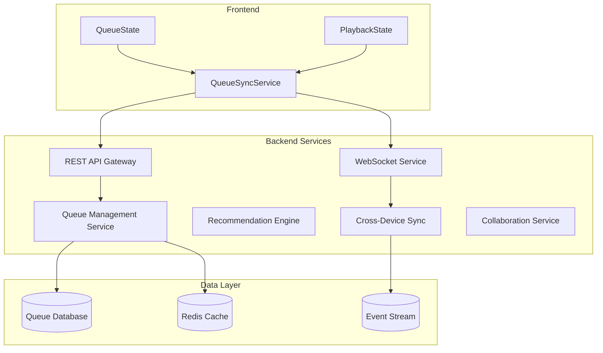

# Backend API Integration Patterns for Queue Management

## Architecture Overview



## 1. Cross-Device Continuity

### Backend Implementation

**Database Schema:**
```sql
-- User playback state table
CREATE TABLE user_playback_state (
    user_id UUID PRIMARY KEY,
    current_queue_id UUID,
    current_track_id UUID,
    position_seconds INTEGER,
    is_playing BOOLEAN,
    volume INTEGER,
    device_id VARCHAR(255),
    last_updated TIMESTAMP DEFAULT CURRENT_TIMESTAMP,
    FOREIGN KEY (current_queue_id) REFERENCES queues(id)
);

-- Device sync events
CREATE TABLE device_sync_events (
    id UUID PRIMARY KEY,
    user_id UUID,
    device_id VARCHAR(255),
    event_type VARCHAR(50),
    event_data JSONB,
    created_at TIMESTAMP DEFAULT CURRENT_TIMESTAMP
);
```

**API Endpoints:**
```typescript
// Sync playback state across devices
PUT /users/{userId}/playback-state
{
  queueId: string,
  currentTrackId: string,
  position: number,
  isPlaying: boolean,
  deviceId: string,
  timestamp: string
}

// Get latest playback state from other devices
GET /users/{userId}/playback-state?exclude_device={deviceId}

// WebSocket: Real-time device sync
WS /ws/sync/{userId}
Message: {
  type: 'playback_sync',
  deviceId: string,
  data: PlaybackState
}
```

**Backend Service (Node.js/Express):**
```typescript
class CrossDeviceSyncService {
  async updatePlaybackState(userId: string, state: PlaybackState) {
    // Update database
    await this.db.query(`
      INSERT INTO user_playback_state (user_id, current_queue_id, current_track_id, position_seconds, is_playing, device_id)
      VALUES ($1, $2, $3, $4, $5, $6)
      ON CONFLICT (user_id) DO UPDATE SET
        current_queue_id = $2,
        current_track_id = $3,
        position_seconds = $4,
        is_playing = $5,
        device_id = $6,
        last_updated = CURRENT_TIMESTAMP
    `, [userId, state.queueId, state.currentTrackId, state.position, state.isPlaying, state.deviceId]);

    // Broadcast to other devices
    this.websocketService.broadcastToUserDevices(userId, state.deviceId, {
      type: 'playback_sync',
      data: state
    });
  }
}
```

## 2. Collaborative Playlists / Social Features

### Backend Implementation

**Database Schema:**
```sql
-- Collaborative queues
CREATE TABLE collaborative_queues (
    id UUID PRIMARY KEY,
    name VARCHAR(255),
    created_by UUID,
    created_at TIMESTAMP DEFAULT CURRENT_TIMESTAMP,
    is_public BOOLEAN DEFAULT FALSE
);

-- Queue collaborators
CREATE TABLE queue_collaborators (
    queue_id UUID,
    user_id UUID,
    permission_level VARCHAR(20) DEFAULT 'contributor', -- owner, admin, contributor, viewer
    joined_at TIMESTAMP DEFAULT CURRENT_TIMESTAMP,
    PRIMARY KEY (queue_id, user_id)
);

-- Queue modification history
CREATE TABLE queue_modifications (
    id UUID PRIMARY KEY,
    queue_id UUID,
    user_id UUID,
    action VARCHAR(50), -- add_track, remove_track, reorder, etc.
    track_id UUID,
    position INTEGER,
    created_at TIMESTAMP DEFAULT CURRENT_TIMESTAMP
);
```

**API Endpoints:**
```typescript
// Create collaborative queue
POST /queues/collaborative
{
  name: string,
  tracks: string[],
  isPublic: boolean,
  collaborators: string[]
}

// Add collaborator
POST /queues/{queueId}/collaborators
{
  userId: string,
  permissionLevel: 'admin' | 'contributor' | 'viewer'
}

// Add tracks to collaborative queue
POST /queues/{queueId}/tracks
{
  tracks: string[],
  position?: number,
  addedBy: string
}

// Real-time collaboration events
WS /ws/queues/{queueId}
Message: {
  type: 'track_added' | 'track_removed' | 'collaborator_joined',
  userId: string,
  data: any
}
```

## 3. Radio Stations + Infinite Queues

### Backend Implementation

**Streaming Queue Architecture:**
```typescript
class RadioQueueService {
  async initializeRadioQueue(stationId: string, userId: string) {
    // Generate initial batch based on station algorithm
    const initialTracks = await this.recommendationEngine.generateRadioTracks(stationId, userId, 20);
    
    // Create queue with streaming capability
    const queue = await this.createQueue({
      type: 'radio',
      stationId,
      userId,
      isInfinite: true,
      initialTracks
    });

    // Preload next batch
    this.preloadNextBatch(queue.id, userId);
    
    return queue;
  }

  async getMoreTracks(queueId: string, count: number) {
    const queue = await this.getQueue(queueId);
    const newTracks = await this.recommendationEngine.generateRadioTracks(
      queue.stationId, 
      queue.userId, 
      count,
      { excludeRecent: queue.recentTrackIds }
    );

    await this.appendToQueue(queueId, newTracks);
    return newTracks;
  }
}
```

**API Endpoints:**
```typescript
// Initialize radio queue
POST /radio/{stationId}/queue
{
  userId: string,
  deviceId: string,
  preferences: UserPreferences
}

// Extend radio queue
GET /queues/{queueId}/extend?count=10

// Report listening behavior for algorithm improvement
POST /radio/{stationId}/feedback
{
  trackId: string,
  action: 'skip' | 'like' | 'complete',
  position: number
}
```

## 4. Recommendation Contexts

### Backend Implementation

**ML Pipeline Integration:**
```typescript
class RecommendationService {
  async generateContextualQueue(context: string, userId: string, seedTracks?: string[]) {
    const userProfile = await this.getUserProfile(userId);
    const listeningHistory = await this.getListeningHistory(userId, 30); // Last 30 days
    
    // Different algorithms based on context
    let tracks;
    switch (context) {
      case 'discover_weekly':
        tracks = await this.discoverWeeklyAlgorithm(userProfile, listeningHistory);
        break;
      case 'daily_mix':
        tracks = await this.dailyMixAlgorithm(userProfile, seedTracks);
        break;
      case 'album_radio':
        tracks = await this.albumRadioAlgorithm(seedTracks[0], userProfile);
        break;
    }

    return this.createQueue({
      type: 'recommendations',
      context,
      userId,
      tracks,
      metadata: { refreshable: true }
    });
  }
}
```

**API Endpoints:**
```typescript
// Generate recommendation queue
POST /recommendations/queue
{
  context: 'discover_weekly' | 'daily_mix' | 'album_radio',
  seedTracks?: string[],
  userId: string,
  preferences: UserPreferences
}

// Refresh recommendations
POST /queues/{queueId}/refresh

// Track recommendation feedback
POST /recommendations/feedback
{
  trackId: string,
  context: string,
  feedback: 'positive' | 'negative' | 'neutral'
}
```

## 5. Smart Context Switching

### Backend Implementation

**Context Detection Service:**
```typescript
class ContextualQueueService {
  async getContextualQueues(context: ContextData, userId: string) {
    const userPreferences = await this.getUserPreferences(userId);
    const historicalContextData = await this.getHistoricalContext(userId);
    
    // ML model to predict appropriate queues
    const predictions = await this.contextMLModel.predict({
      location: context.location,
      timeOfDay: context.timeOfDay,
      activity: context.activity,
      weather: context.weather,
      userPreferences,
      historicalContextData
    });

    // Fetch or generate queues based on predictions
    const queues = await Promise.all(
      predictions.map(pred => this.getOrCreateContextualQueue(pred, userId))
    );

    return queues;
  }
}
```

**API Endpoints:**
```typescript
// Get contextual queue suggestions
POST /queues/contextual
{
  context: {
    location?: string,
    activity?: string,
    timeOfDay?: string,
    weather?: string
  },
  userId: string
}

// Report context change
POST /users/{userId}/context
{
  location: string,
  activity: string,
  timestamp: string
}
```

## 6. Offline/Caching Strategies

### Backend Implementation

**Offline Sync Service:**
```typescript
class OfflineSyncService {
  async syncOfflineChanges(userId: string, changes: OfflineChange[]) {
    const conflicts = [];
    
    for (const change of changes) {
      try {
        await this.applyChange(change);
      } catch (error) {
        if (error.type === 'CONFLICT') {
          conflicts.push({
            change,
            serverState: await this.getServerState(change.resourceId),
            resolution: await this.suggestConflictResolution(change, error)
          });
        }
      }
    }

    return { conflicts, synced: changes.length - conflicts.length };
  }

  async prepareOfflineQueue(queueId: string, userId: string) {
    const queue = await this.getQueue(queueId);
    const downloadableUrls = await this.getDownloadableTrackUrls(queue.trackIds, userId);
    
    return {
      queue,
      tracks: downloadableUrls,
      expires: Date.now() + (7 * 24 * 60 * 60 * 1000) // 7 days
    };
  }
}
```

**API Endpoints:**
```typescript
// Sync offline changes
POST /sync/offline
{
  changes: OfflineChange[],
  lastSyncTimestamp: string
}

// Prepare queue for offline
GET /queues/{queueId}/offline
Response: {
  queue: Queue,
  downloadUrls: TrackDownloadUrl[],
  expires: number
}
```

## 7. Live Events / Shared Listening

### Backend Implementation

**Listening Party Service:**
```typescript
class ListeningPartyService {
  async createParty(hostId: string, queueId: string) {
    const party = await this.db.query(`
      INSERT INTO listening_parties (id, host_id, queue_id, created_at)
      VALUES ($1, $2, $3, CURRENT_TIMESTAMP)
      RETURNING *
    `, [generateUUID(), hostId, queueId]);

    // Create real-time room
    this.websocketService.createRoom(`party:${party.id}`);
    
    return party;
  }

  async syncPartyPlayback(partyId: string, playbackState: PlaybackState) {
    // Update party state
    await this.updatePartyPlayback(partyId, playbackState);
    
    // Broadcast to all party members
    this.websocketService.broadcastToRoom(`party:${partyId}`, {
      type: 'playback_sync',
      data: playbackState,
      timestamp: Date.now()
    });
  }

  async handleLatencyCompensation(partyId: string, memberLatencies: Map<string, number>) {
    const averageLatency = Array.from(memberLatencies.values()).reduce((a, b) => a + b, 0) / memberLatencies.size;
    
    // Adjust playback timing for synchronization
    return this.calculateSyncAdjustment(averageLatency);
  }
}
```

**WebSocket Events:**
```typescript
// Party playback synchronization
WS /ws/party/{partyId}
Messages:
- { type: 'playback_sync', position: number, isPlaying: boolean, timestamp: number }
- { type: 'member_joined', userId: string, deviceInfo: any }
- { type: 'queue_updated', tracks: Track[] }
- { type: 'latency_measurement', ping: number, pong: number }
```

## Real-time Communication Patterns

### WebSocket Message Types:
```typescript
interface QueueSyncMessage {
  type: 'queue_created' | 'queue_updated' | 'item_added' | 'item_removed' | 'playback_sync' | 'member_joined';
  queueId: string;
  userId: string;
  deviceId: string;
  timestamp: number;
  data: any;
  sequenceNumber?: number; // For ordered delivery
}
```

### Event Sourcing Pattern:
```sql
-- Event store for queue changes
CREATE TABLE queue_events (
    id UUID PRIMARY KEY,
    queue_id UUID,
    event_type VARCHAR(50),
    event_data JSONB,
    user_id UUID,
    device_id VARCHAR(255),
    sequence_number BIGSERIAL,
    created_at TIMESTAMP DEFAULT CURRENT_TIMESTAMP
);

-- Event projections for current state
CREATE TABLE queue_projections (
    queue_id UUID PRIMARY KEY,
    current_state JSONB,
    last_event_sequence BIGINT,
    updated_at TIMESTAMP DEFAULT CURRENT_TIMESTAMP
);
```

This architecture provides:
- **Real-time synchronization** via WebSockets
- **Conflict resolution** through event sourcing
- **Offline support** with sync patterns
- **Scalability** through microservices
- **Reliability** with proper error handling and retry mechanisms

Each pattern can be implemented independently and combined as needed for your specific use cases. 