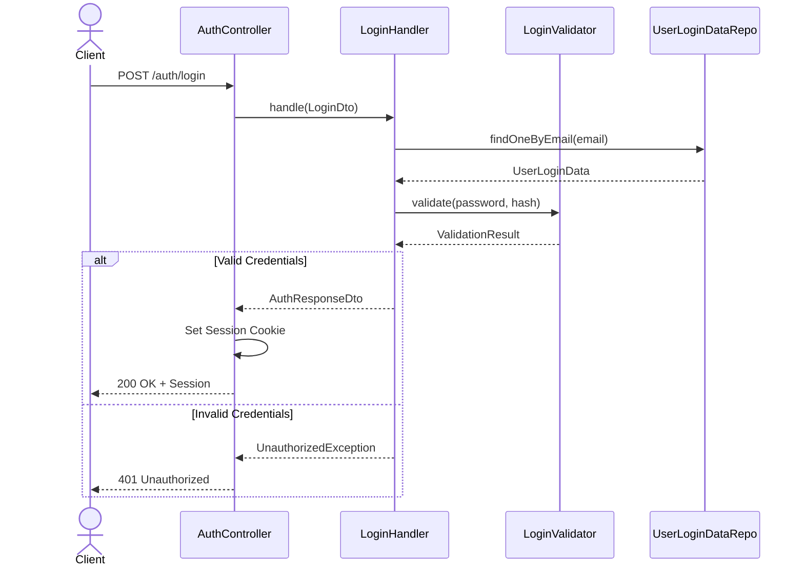

# Authentication

## Overview
This document describes the authentication system implementation and flows in the Neko Music application. The system implements secure token-based authentication with role-based access control.

## Key Functionality
- **User Authentication**: Email/password-based login
- **Session Management**: Token-based session handling
- **Authorization**: Role-based access control with permissions
- **Silent Authentication**: Automatic session restoration
- **Security**: CSRF protection, secure cookies, rate limiting

## Data Models

### User Login Data
```typescript
interface UserLoginData {
  id: string;
  email: string;
  password_hash: string;
  permissions: Permission[];
  created_at: Date;
  updated_at: Date;
}
```

### Session
```typescript
interface Session {
  accessToken: string;
  permissions: Permission[];
}
```

### Authentication DTOs
```typescript
interface LoginDto {
  email: string;
  password: string;
}

interface RegisterDto extends LoginDto {
  username: string;
}

interface AuthResponseDto {
  accessToken: string;
}
```

## API Endpoints

### Authentication Controller (`/auth`)
| Method | Endpoint    | Description           | Request Body | Response        |
|--------|-------------|--------------------|--------------|-----------------|
| POST   | /login      | User login         | LoginDto     | AuthResponseDto |
| POST   | /register   | User registration  | RegisterDto  | AuthResponseDto |
| POST   | /logout     | User logout        | -            | void           |
| GET    | /whoami     | Get current user   | -            | UserModel      |

## Process Flow

### Authentication Flow


## Implementation Details

### Backend Components

#### Authentication Module
```typescript
@Global()
@Module({
  controllers: [AuthController],
  providers: [
    AuthGuard,
    LoginHandler,
    LoginValidator,
    RegisterHandler,
    RegisterValidator,
    UserLoginDataRepository
  ],
})
export class AuthenticationModule {}
```

#### Authentication Guard
```typescript
@Injectable()
export class AuthGuard implements CanActivate {
  canActivate(context: ExecutionContext): boolean {
    // Validate session token
    // Check public route exceptions
    // Verify user permissions
  }
}
```

### Frontend Components

#### Auth State Management
```typescript
@Injectable()
export class AuthSessionState {
  readonly accessToken = signal<string | null>(null);
  readonly permissions = signal<Permission[]>([]);
  readonly isAuthenticated = computed(() => Boolean(this.accessToken()));

  updateSession(accessToken: string): void {
    // Update session state
    // Parse and store permissions
  }
}
```

#### Authentication Strategy
```typescript
@Injectable()
export class CredentialsAuthStrategy extends BaseAuthStrategy {
  authenticate(credentials: Credentials): Observable<Session> {
    return this.authRepository.login(credentials).pipe(
      tap((session) => {
        // Store session
        // Set cookies
      })
    );
  }
}
```

## Security Measures

### Password Security
- Bcrypt hashing with configurable salt rounds
- Minimum password requirements
- Constant-time comparison for password validation

### Session Security
- HTTP-only cookies
- Secure cookie attributes
- CSRF protection
- Session expiration
- Token rotation

### API Security
- Rate limiting
- Request validation
- Error sanitization
- CORS configuration

## Error Handling

### Authentication Errors
- Invalid credentials
- Account lockout
- Session expiration
- Network failures

### Error Responses
```typescript
interface AuthError {
  statusCode: number;
  message: string;
  errors?: string[];
}
```

## Configuration

### Environment Variables
```typescript
interface AuthConfig {
  JWT_SECRET: string;
  JWT_EXPIRATION: string;
  SALT_ROUNDS: number;
  COOKIE_DOMAIN: string;
  SECURE_COOKIES: boolean;
}
```

### Provider Configuration
```typescript
export const provideAuth = (config: AuthConfig): Provider[] => [
  AuthSessionState,
  AuthStatusState,
  CredentialsAuthStrategy,
  SilentAuthStrategy,
  AuthRepository,
  AuthFacade,
  {
    provide: AUTH_API_URL,
    useValue: config.apiUrl,
  }
];
```

## Testing Strategy

### Unit Tests
- Authentication guards
- Token validation
- Password hashing
- Permission checks

### Integration Tests
- Login flows
- Session management
- Error handling
- Permission validation

### Contract Tests
- API endpoints
- Response structures
- Error scenarios
- Token validation
