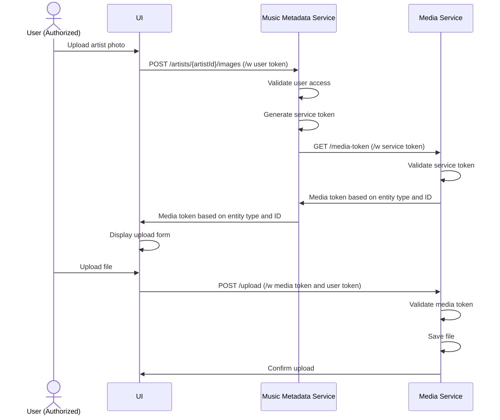

# Media Upload

## Overview
This document describes the media upload process flow and implementation details.

## Key Functionality
- **Media Upload**: Upload media files to the server
- **Media Validation**: Validate media files

## Process Flow
The media upload process follows this sequence:

## Process Steps

## Error Handling
- File size limits
- Invalid file types
- Storage failures